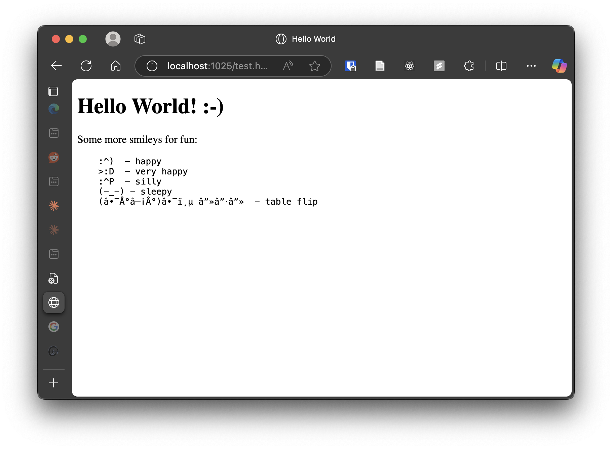

# HTTP Server Implementation Project

## Overview
This project implements a subset of the HTTP/1.1 protocol. The server (is planned to) handle basic HTTP requests, supports concurrent connections, and serves static files including HTML, JPEG, and PNG formats.

## Screenshot


## Current Implementation Status

### Completed Components:
- [x] Basic server initialization and socket setup
- [x] Initial request parsing structure
- [x] Complete request parsing implementation
- [x] Response generation
- [x] Response sending
- [x] Connection timeout handling
- [x] Threading/concurrency support
- [x] Connection: close header handling
- [x] Error response handling (400, 403, 404)
- [x] Memory management and cleanup

## Building and Running

### Prerequisites
- POSIX-compliant system
- C/C++ compiler with C++11 support
- pthread library
- make
- If you want to run http test, Poetry (in mac, you can install it by using `brew install poetry`)

### Build Instructions
```bash
make
```

### Test Instructions
```bash
make test
```

If you want to run the python test, do:
```bash
make clean && make

# must have poetry first
# port for testing is set to port 1025
python tests/test.py
poetry install
poetry run python test_concurrency.py 
```

### Running the Server
```bash
# Run (specify port and document root)
./httpd 8080 /path/to/docs
```


## Implementation Details
- Thread synchronization using mutex and condition variables (thanks CSAPP)
- Robust request parsing with buffer management (credit to network_utils)
- Socket timeouts for stale connections
- Resource cleanup and error recovery
- Thread pool with 100 workers

## Testing
Used both C and Python test suites:

- C tests for unit testing (request parsing, response generation)
- Python tests for integration testing (actual HTTP requests)
- Python tests for concurrency
    - Just normal sanity check - create 2, 50, 100 threads, check the average time for request to be returned
    - Result: 
        ```
        Testing with 10 concurrent requests:
        Average response time: 0.021s
        Max response time: 0.024s
        Min response time: 0.017s
        Successful requests: 10/10

        Testing with 50 concurrent requests:
        Average response time: 0.020s
        Max response time: 0.033s
        Min response time: 0.009s
        Successful requests: 50/50

        Testing with 100 concurrent requests:
        Average response time: 0.025s
        Max response time: 0.055s
        Min response time: 0.008s
        Successful requests: 100/100
        ```
- Memory checks using AddressSanitizer

### Test files:
1. `tests/test_main.c`: Unit tests
2. `tests/test.py`: Integration tests
3. `tests/test_concurrency.py`: Concurrency test

## Attributes
The network utilities code (network_utils.c and network_utils.h) is adapted from the Computer Systems: A Programmer's Perspective (CS:APP) textbook.


